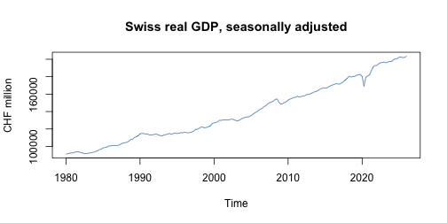

## What is dataseries.org?

Switzerland publishes a lot of official statistics, but they are spread across
many providers: the Federal Statistical Office, SECO, the National Bank, the
Federal Finance Administration and others. Each has its own portal, its own
file formats and its own update schedule.

[dataseries.org](https://dataseries.org) collects them in one place. It tracks
the sources, harmonises them into a single structure and keeps them current.
This package is a client for its public API, so you can pull any of those
series straight into R.

## How the data is organised

Data comes in **datasets**. A dataset is a family of related series and is
usually a multi-dimensional *cube*: one time series is a single cell of that
cube, addressed by the dataset plus one code per dimension.

Four functions cover the whole package:

- `ds_catalog()` lists the datasets.
- `ds_search()` lists the individual series, so you can grep for one.
- `ds_meta()` describes a dataset's dimensions and their codes.
- `ds()` downloads.

## Finding something

Start with the catalog. One row per dataset:


``` r
cat <- ds_catalog()
nrow(cat)
#> [1] 70
head(cat[, c("id", "title", "frequency", "n_series")])
#>                           id                               title   frequency
#> 1             ch_adecco_sjmi Adecco Group Swiss Job Market Index   quarterly
#> 2            ch_ffa_finances                 Government finances      annual
#> 3               ch_fso_besta           Jobs by economic division   quarterly
#> 4       ch_fso_besta_outlook                  Employment outlook   quarterly
#> 5 ch_fso_construction_prices                 Construction prices semi-annual
#> 6                 ch_fso_cpi   Consumer prices (detailed basket)     monthly
#>   n_series
#> 1        4
#> 2      387
#> 3       60
#> 4       20
#> 5        3
#> 6      595
```

If you know roughly what you want, `ds_search()` is finer grained. It returns
one row per series across all datasets:


``` r
hits <- ds_search("unemployment rate")
head(hits[, c("dataset", "dim", "code", "label")])
#>             dataset    dim code             label
#> 1 ch_fso_unemp_rate origin  tot             Total
#> 2 ch_fso_unemp_rate origin   ch   Swiss nationals
#> 3 ch_fso_unemp_rate origin   ex Foreign nationals
```

The `dataset`, `dim` and `code` columns are exactly what `ds()` expects, so a
search result can be fed straight back in.

## Downloading

The simplest call takes a dataset id and returns every series in it, in long
format:


``` r
cpi <- ds("ch_fso_cpi")
head(cpi)
#>       item       date   value
#> 1    100_1 1982-12-01 70.0205
#> 2   100_10 1982-12-01 34.7833
#> 3  100_100 1982-12-01 59.1566
#> 4 100_1001 1982-12-01 69.2540
#> 5 100_1002 1982-12-01 65.3241
#> 6 100_1010 1982-12-01 82.6664
```

To pick one series, pass the dimension codes as named arguments. Filtering
happens on the server, so this does not download the whole cube first:


``` r
total <- ds("ch_fso_cpi", item = "100_100", from = "2015-01-01")
head(total)
#>      item       date   value
#> 1 100_100 2015-01-01 93.5394
#> 2 100_100 2015-02-01 93.2989
#> 3 100_100 2015-03-01 93.6033
#> 4 100_100 2015-04-01 93.4335
#> 5 100_100 2015-05-01 93.6510
#> 6 100_100 2015-06-01 93.7198
```

## Working with cubes

Which dimensions does a dataset have? `ds_meta()` tells you:


``` r
m <- ds_meta("ch_seco_gdp")
m$dim_order
#> [[1]]
#> [1] "type"
#> 
#> [[2]]
#> [1] "structure"
#> 
#> [[3]]
#> [1] "seas_adj"
names(m$dimensions$type$levels)
#> [1] "nom"  "real" "gc_q" "gc_y"
```

So the GDP dataset splits three ways, and a single cell needs one code from
each:


``` r
gdp <- ds("ch_seco_gdp", type = "real", structure = "gdp", seas_adj = "csa")
tail(gdp)
#>     type structure seas_adj       date    value
#> 180 real       gdp      csa 2024-10-01 200725.0
#> 181 real       gdp      csa 2025-01-01 202350.7
#> 182 real       gdp      csa 2025-04-01 202640.5
#> 183 real       gdp      csa 2025-07-01 201781.0
#> 184 real       gdp      csa 2025-10-01 202218.0
#> 185 real       gdp      csa 2026-01-01 203544.3
```

## Time series objects

Every series on dataseries.org is regular (annual, quarterly or monthly), so it
maps cleanly onto R's `ts` class. Pass `class = "ts"`:


``` r
gdp_ts <- ds("ch_seco_gdp", type = "real", structure = "gdp", seas_adj = "csa",
             class = "ts")
plot(gdp_ts, main = "Swiss real GDP, seasonally adjusted",
     ylab = "CHF million", col = "steelblue")
```

<div class="figure">

<p class="caption">plot of chunk ts</p>
</div>

Select several cells and you get an `mts` with one column per series:


``` r
two <- ds("ch_fso_cpi", item = c("100_100", "100_1"), from = "2020-01-01",
          class = "ts")
head(two)
#>            100_1 100_100
#> Jan 2020 96.2727 94.0756
#> Feb 2020 96.3427 94.1922
#> Mar 2020 97.0131 94.2645
#> Apr 2020 97.6975 93.9216
#> May 2020 98.3081 93.9610
#> Jun 2020 99.2729 93.9806
```

For `xts`, convert in one line:
`xts::as.xts(ds("ch_fso_cpi", item = "100_100", class = "ts"))`.

## Labels in other languages

The providers publish their labels in German, French and Italian as well, and
dataseries.org keeps them. Pass `lang` to `ds_catalog()` or `ds_search()`:


``` r
head(ds_catalog(lang = "de")[, c("id", "title")])
#>                           id                                       title
#> 1             ch_adecco_sjmi         Adecco Group Swiss Job Market Index
#> 2            ch_ffa_finances                        Öffentliche Finanzen
#> 3               ch_fso_besta      Beschäftigte nach Wirtschaftsabteilung
#> 4       ch_fso_besta_outlook                    Beschäftigungsaussichten
#> 5 ch_fso_construction_prices                                   Baupreise
#> 6                 ch_fso_cpi Konsumentenpreise (detaillierter Warenkorb)
```

Searching matches the labels in the chosen language, so German terms work
directly:


``` r
ds_search("arbeitslosen", lang = "de")[, c("dataset", "code", "label")]
#>          dataset               code                                label
#> 1 ch_seco_concon ks_i32_unemp_exp_q 3.2 Entwicklung der Arbeitslosenzahl
```

Where a translation is missing, English is used.

## Caching

Everything downloaded is cached in memory for the session, so repeating a call
costs nothing. `cache_rm()` empties the cache and forces a fresh download:


``` r
cache_ls()
#> [1] "csv:https://api.dataseries.org/series.csv?dataset=ch_fso_cpi"                                                     
#> [2] "csv:https://api.dataseries.org/series.csv?dataset=ch_fso_cpi&dims=item%3D100_100&from=2015-01-01"                 
#> [3] "csv:https://api.dataseries.org/series.csv?dataset=ch_fso_cpi&dims=item%3D100_100%2C100_1&from=2020-01-01"         
#> [4] "csv:https://api.dataseries.org/series.csv?dataset=ch_seco_gdp&dims=type%3Dreal%3Bstructure%3Dgdp%3Bseas_adj%3Dcsa"
#> [5] "json:https://api.dataseries.org/catalog"                                                                          
#> [6] "json:https://api.dataseries.org/dataset/ch_seco_gdp/meta"                                                         
#> [7] "json:https://api.dataseries.org/search-index.json"
cache_rm()
```

## Beyond R

The same data is available from Python through the
[dataseries](https://github.com/cynkra/dataseries-py) package, and as plain CSV
from any tool that can read a URL:

```
https://api.dataseries.org/series.csv?dataset=ch_fso_cpi&dims=item=100_100
```
